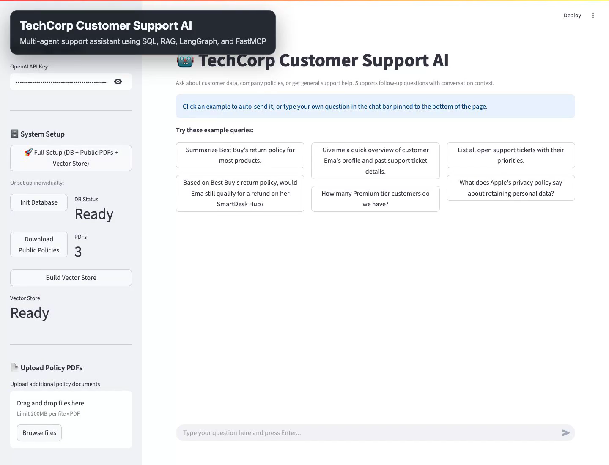

# TechCorp Customer Support AI -- Multi-Agent System

A **Generative AI-powered Multi-Agent System** that enables natural language interaction with both structured customer data (SQL) and unstructured policy documents (PDF). Built with **LangChain**, **LangGraph**, **ChromaDB**, and **Streamlit**, with a **FastMCP** server that exposes the same backend to MCP-compatible clients.

## Demo Video

<p align="center">
  <a href="https://www.loom.com/share/47f4b3035f134bb3831ceaa528bf1aa0">
    
  </a>
</p>

<p align="center">
  <a href="https://www.loom.com/share/47f4b3035f134bb3831ceaa528bf1aa0"><strong>Watch the demo video on Loom</strong></a>
</p>

GitHub repository READMEs do not reliably render inline video players, so the preview image above opens the Loom recording. A local fallback copy is also available at [demo_assets/readme/techcorp-demo.mp4](demo_assets/readme/techcorp-demo.mp4).

For a recording checklist and demo prompts, see [VIDEO_WORKFLOW.md](docs/guides/VIDEO_WORKFLOW.md).
For a silent-caption version, see [VIDEO_WORKFLOW_NO_VOICE.md](docs/guides/VIDEO_WORKFLOW_NO_VOICE.md).

---

## Live Demo

🌐 **Streamlit App:** [https://genaiassessment.streamlit.app](https://genaiassessment.streamlit.app)

The deployed Streamlit version of the project is available at the link above.

---

## Table of Contents

- [Architecture](#architecture)
- [Hybrid Query Flow](#hybrid-query-flow)
- [Features](#features)
- [Technology Stack](#technology-stack)
- [Project Structure](#project-structure)
- [Setup & Installation](#setup--installation)
- [Usage](#usage)
- [Example Queries](#example-queries)
- [MCP Server](#mcp-server)
- [Database Schema](#database-schema)
- [Document Chunking Strategy](#document-chunking-strategy)
- [Architecture Decisions & Tradeoffs](#architecture-decisions--tradeoffs)
- [Evaluation & Testing](#evaluation--testing)
- [Limitations & Known Constraints](#limitations--known-constraints)

---

## Architecture

```
                  ┌────────────────┐
                  │  Streamlit UI  │
                  └───────┬────────┘
                          │
                  ┌───────▼────────┐
                  │ LangGraph      │
                  │ Router         │
                  └─┬────┬────┬──┬─┘
                    │    │    │  │
        ┌───────────┘    │    │  └──────────┐
        ▼                │    │             ▼
  ┌───────────┐          │    │       ┌───────────┐
  │ SQL Agent │          │    │       │  General  │
  └─────┬─────┘          │    │       │  Agent    │
        │           ┌────┘    └───┐   └───────────┘
        ▼           ▼             ▼
  ┌──────────┐ ┌─────────────────────┐
  │  SQLite  │ │    Hybrid Path      │
  │ Database │ │ SQL Facts + RAG     │
  └──────────┘ │    → Synthesizer    │
               └──────────┬──────────┘
                          │
               ┌──────────▼──────────┐
               │   RAG Agent         │
               │   → ChromaDB       │
               └─────────────────────┘

  MCP Clients ──▶ FastMCP Server ──▶ same backend logic
```

### How It Works

1. User submits a query via **Streamlit UI** or **MCP client**.
2. The **LangGraph Router** classifies the query:
   - **SQL** → SQL Agent queries the database.
   - **RAG** → RAG Agent searches policy documents.
   - **Hybrid** → Both agents run sequentially, then a **Synthesizer** merges both results.
   - **General** → General Agent handles greetings and off-topic questions.
3. **Conversation context** from prior turns enables follow-up questions (e.g., "What about her last order?" after asking about Ema).
4. The Streamlit app calls the agent graph directly; the MCP server exposes the same backend as external tools.

---

## Hybrid Query Flow

A key differentiator: queries requiring **both structured data and policy knowledge** invoke multiple agents.

**User asks:** *"Based on Best Buy's return policy, would Ema still qualify for a refund on her SmartDesk Hub?"*

```
Step 1  Router → "hybrid" (needs customer data + policy)

Step 2  SQL Agent retrieves Ema's order:
        SELECT o.order_date, o.status, p.product_name, p.category
        FROM orders o JOIN products p ... JOIN customers c ...
        WHERE c.first_name LIKE '%Ema%' AND p.product_name LIKE '%SmartDesk%'
        → SmartDesk Hub ordered 2023-06-15, Delivered.

Step 3  RAG Agent retrieves Best Buy return policy:
        → "Most products: 15-day return window, 30/45 days for members."

Step 4  Synthesizer combines both:
        → "Ema purchased SmartDesk Hub on June 15, 2023. Best Buy's policy
           allows 15-45 days depending on membership. Her order is years
           past any return window — she would not qualify."
```

---

## Features

- **Natural language SQL queries** -- translates to SQL, validates read-only, executes, summarizes with source references.
- **PDF policy search** -- chunks, embeds, and searches policy documents with source citations (file, page, line range).
- **Hybrid multi-agent reasoning** -- queries spanning data + policy invoke both agents with synthesized output.
- **Conversation context** -- follow-up questions resolve pronouns from prior turns.
- **Intelligent routing** -- LangGraph supervisor with four routes (SQL, RAG, hybrid, general).
- **MCP Server** -- FastMCP server exposes the same backend as tools for external clients.
- **SQL safety** -- regex validation blocks non-SELECT queries before execution.
- **Source traceability** -- every response includes database table/SQL or document file/page/line references.

---

## Technology Stack

| Component         | Technology                    | Purpose                                          |
|-------------------|-------------------------------|--------------------------------------------------|
| Orchestration     | LangGraph                     | Multi-agent state graph with conditional routing  |
| LLM Framework     | LangChain                     | Agent abstractions and prompt management          |
| LLM               | OpenAI GPT-4o-mini            | Routing, SQL generation, answer synthesis         |
| Embeddings        | OpenAI text-embedding-3-small | Document chunk vectorization (1536 dims)          |
| Structured DB     | SQLite                        | Customer profiles, orders, support tickets        |
| Vector DB         | ChromaDB                      | Semantic search over policy documents             |
| PDF Processing    | PyMuPDF (fitz)                | Text extraction from PDFs                         |
| MCP Server        | FastMCP                       | Standardized tool exposure via MCP protocol       |
| UI                | Streamlit                     | Chat interface with session state                 |
| PDF Seeding       | Python `urllib.request`       | Download public policy PDFs from official URLs    |

---

## Project Structure

```
├── app.py                     # Streamlit UI (presentation layer)
├── setup.py                   # One-command setup script
├── requirements.txt           # Python dependencies
├── .env.example               # API key template
│
├── agents/                    # Orchestration + domain agents
│   ├── graph.py               #   LangGraph router, hybrid path, synthesizer
│   ├── sql_agent.py           #   NL → SQL → validate → execute → NL
│   └── rag_agent.py           #   Semantic search + reranking over policy docs
│
├── data/                      # Data layer
│   ├── init_db.py             #   SQLite init + 32 customers, 15 products, 70 orders, 30 tickets
│   └── generate_policies.py   #   Download public policy PDFs from official URLs
│
├── utils/
│   └── vector_store.py        #   ChromaDB vector store management + caching
│
├── mcp_server/
│   └── server.py              #   FastMCP server with tool endpoints
│
├── docs/                      # Policy PDFs + source manifest
│   ├── *.pdf                  #   Downloaded public policy corpus
│   ├── policy_sources.json    #   Source URLs for each PDF
│   └── guides/
│       ├── MANUAL_TESTS.md    #   Human QA checklist
│       └── VIDEO_WORKFLOW.md  #   Demo recording script
│
├── demo_assets/               # Upload-ready demo PDFs for testing
│   └── upload_pdfs/
│       ├── single/            #   Simplest one-file demo
│       ├── standard/          #   Distinct mock policy pack
│       └── conflicts/         #   Overlapping-policy stress test
│
├── tests/
│   ├── e2e/                   #   Playwright app verification
│   └── test_*.py              #   Unit/regression tests
│
└── output/                    #   Runtime artifacts (gitignored)
```

---

## Setup & Installation

### Prerequisites

- Python 3.10+
- An OpenAI API key

### Steps

```bash
# 1. Clone
git clone https://github.com/aidenmak0624/GenAI_assessment.git
cd GenAI_assessment

# 2. Virtual environment
python -m venv venv
source venv/bin/activate    # Windows: venv\Scripts\activate

# 3. Install dependencies
pip install -r requirements.txt

# 4. API key
cp .env.example .env
# Edit .env and add your OpenAI API key

# 5. Setup (DB + PDFs + vector store)
python setup.py

# 6. Launch
streamlit run app.py
```

The app opens at `http://localhost:8501`.

---

## Usage

1. **Enter your OpenAI API key** in the sidebar (or set it in `.env`).
2. **Click "Full Setup"** to initialize database, download policy PDFs, and build the vector store.
3. **Chat** -- type questions or click example buttons.
4. **Upload PDFs** via the sidebar -- automatically re-indexed into the vector store.
5. **Follow-up questions** work -- the system preserves conversation context.

### Default Public Policy Corpus

The setup downloads these publicly available PDFs:

- [Best Buy Return & Exchange Policy](https://partners.bestbuy.com/documents/20126/3029894/Return%2B%26%2BExchange%2BPolicy.pdf/ee165181-38ed-21af-be39-30c2c7b34597?t=1629819812060)
- [Apple Privacy Policy](https://www.apple.com/legal/privacy/pdfs/apple-privacy-policy-en-ww.pdf)
- [Microsoft Azure Support Plans](https://azure.microsoft.com/mediahandler/files/resourcefiles/azure-support-plans-datasheet/Azure%20Support%20Datasheet_FINAL.pdf)

---

## Example Queries

### SQL Agent (structured data)
- *"Give me a quick overview of customer Ema's profile and past support ticket details."*
- *"What orders has Liam Smith placed?"*
- *"List all open support tickets with their priorities."*
- *"How many Premium tier customers do we have?"*

### RAG Agent (policy documents)
- *"Summarize Best Buy's return policy for most products."*
- *"What does Apple's privacy policy say about retaining personal data?"*
- *"What response times are listed in the Azure Support Plans document?"*
- *"Does the Best Buy return policy mention restocking fees?"*

### Hybrid (SQL + RAG)
- *"Based on Best Buy's return policy, would Ema still qualify for a refund on her SmartDesk Hub?"*
- *"Given Liam's 2023 ErgoKey order, would Best Buy's return policy still allow a standard return?"*

### Follow-up (context-aware)
1. *"Tell me about customer Ema Johnson."* → SQL Agent retrieves profile
2. *"What about her support tickets?"* → resolves "her" as Ema
3. *"Is she eligible for a refund?"* → hybrid: checks orders + policy

---

## MCP Server

The **FastMCP server** exposes the multi-agent backend as tools via the Model Context Protocol.

**Why MCP?** Standardized tool discovery and invocation. Clients auto-discover tools via JSON Schema. The same server works with Claude Desktop, IDE extensions, or custom apps. New tools can be added without client changes.

> The Streamlit app calls the agent graph directly. The MCP server is an **alternative integration path** for external clients.

### Running

```bash
python mcp_server/server.py
```

### Tools

| Tool                    | Description                                                  |
|-------------------------|--------------------------------------------------------------|
| `query_customer_data`   | Query customer profiles, orders, tickets via natural language |
| `search_policies`       | Search policy documents via natural language                  |
| `customer_support_chat` | Auto-routed support with optional conversation history        |

### MCP Configuration

```json
{
  "mcpServers": {
    "customer-support": {
      "command": "python",
      "args": ["mcp_server/server.py"],
      "env": { "OPENAI_API_KEY": "your-api-key" }
    }
  }
}
```

---

## Database Schema

Four relational tables seeded with **32 customers**, **15 products**, **70 orders**, and **30 support tickets**.

```
customers 1──┬──* orders
             └──* support_tickets
products  1─────* orders
```

| Table             | Key Columns                                                                    |
|-------------------|--------------------------------------------------------------------------------|
| **customers**     | customer_id, first_name, last_name, email, phone, city, country, membership_tier (Standard/Premium/Gold), account_created, is_active |
| **products**      | product_id, product_name, category (Software/Hardware/Service), price, description |
| **orders**        | order_id, customer_id (FK), product_id (FK), order_date, quantity, total_amount, status (Delivered/Active/Cancelled/Completed) |
| **support_tickets** | ticket_id, customer_id (FK), subject, description, category, priority (Critical/High/Medium/Low), status (Open/Resolved/Closed), created_at, resolved_at, resolution_notes, assigned_agent |

---

## Document Chunking Strategy

1. **Extract** -- PyMuPDF extracts text page-by-page from each PDF.
2. **Chunk** -- `RecursiveCharacterTextSplitter`: 800 chars, 150 overlap, separators `["\n\n", "\n", ". ", " ", ""]`.
3. **Metadata** -- each chunk stores source filename, page number, line range, and chunk index.
4. **Embed** -- OpenAI `text-embedding-3-small` (1536 dimensions).
5. **Store** -- ChromaDB with cosine similarity.
6. **Retrieve** -- 8 semantic candidates, lexical reranker keeps top 4.

---

## Architecture Decisions & Tradeoffs

| Decision                             | Rationale                                                                 |
|--------------------------------------|---------------------------------------------------------------------------|
| **LangGraph over LangChain Agents**  | State graph with conditional edges gives explicit routing control and supports hybrid flows. |
| **Supervisor routing (not swarm)**   | Central router is predictable and auditable for support use cases.         |
| **SQLite over PostgreSQL**           | Zero-config setup for demo. Production would use PostgreSQL.              |
| **ChromaDB over FAISS/Pinecone**     | Persistent, local, simple API. FAISS lacks persistence; Pinecone needs cloud. |
| **GPT-4o-mini for all agents**       | Cost-effective. Router and SQL gen don't need GPT-4o's capability.        |
| **FastMCP**                          | Minimal, Pythonic MCP tool definitions with auto JSON Schema generation.  |
| **Read-only SQL validation**         | Regex rejects non-SELECT before execution. Defense-in-depth with prompt.  |
| **Sequential hybrid (not parallel)** | Simpler to debug. Latency difference is marginal for this use case.       |

---

## Evaluation & Testing

### Automated Tests

**Playwright E2E** -- verifies the Streamlit UI loads and (with API key) exercises SQL, RAG, and hybrid routes:

```bash
npm install && npx playwright install chromium
npm run test:e2e
```

**Unit tests** -- regression tests for agents and vector store:

```bash
python -m pytest tests/
```

### Manual QA

A step-by-step checklist is in [MANUAL_TESTS.md](docs/guides/MANUAL_TESTS.md). Upload-ready demo PDFs are indexed in [demo_assets/README.md](demo_assets/README.md).

### Sample Test Scenarios

| # | Query | Expected | Agent |
|---|-------|----------|-------|
| 1 | "Summarize Best Buy's return policy" | 15-day window, 30/45-day member extensions | RAG |
| 2 | "Show me Ema Johnson's profile" | Full profile from customers table | SQL |
| 3 | "List all open support tickets" | Open tickets with priorities and agents | SQL |
| 4 | "Would Ema qualify for a refund on her SmartDesk Hub per Best Buy's policy?" | Order is years past return window | Hybrid |
| 5 | "What does Apple say about data retention?" | Retained as long as necessary / required by law | RAG |
| 6 | "Hello!" | Friendly greeting | General |
| 7 | "What was her last order?" (after Ema) | Resolves "her" via context | SQL |
| 8 | "How many Gold tier customers?" | Count from customers table | SQL |

### Quality Measures

- **SQL safety** -- read-only validation blocks destructive queries.
- **Hallucination mitigation** -- RAG agent answers strictly from context; states when info is insufficient.
- **Source citations** -- every response includes database table/SQL trace or document file/page/line references.
- **Error handling** -- SQL errors show the generated query; missing vector store shows setup instructions.

---

## Limitations & Known Constraints

- **Synthetic dataset** -- 32 customers, 15 products, 70 orders, 30 tickets. Production needs real data pipelines.
- **PDF quality** -- text extraction works for digital PDFs; scanned/image PDFs would need OCR.
- **SQL accuracy** -- GPT-4o-mini handles simple queries well; complex multi-join aggregations may fail.
- **No auth / RBAC** -- no user authentication. Production needs role-based access controls.
- **Single-user session** -- Streamlit session state is per-tab. No multi-user or persistent storage.
- **Fixed schema** -- SQL agent's schema is hardcoded; DB changes require prompt updates.
- **No real-time sync** -- customer data is static after seeding.
- **Not for compliance decisions** -- responses should be verified by a human for policy-sensitive matters.

---

## License

This project is for assessment/demonstration purposes.
